2e44 p dsp核，4M RAM，有网口，有M4内核

2e44 lc 无dsp核，3M RAM，无网口，有M4内核

- 是一款高性能、低功耗的嵌入式处理器，特别适合需要数字信号处理和浮点运算的应用场景

二者主频一样

博世六代：2e44（此芯片量产较早，但主频较低），有dsp，没有M4

大陆2944 LP，多个M4核，大陆专供，能用波导

博世5代：

- 低配CR5C B 2x4通道，8156+337，不带高度天线，对称式天线
- 高配CR5C P 3x4通道，8160+357，带高度天线，非对称式天线


SOC的芯片70%价格来自RA


大陆6代用了微多普勒

xc说五代用了微多普勒，具体不清楚


小台架：软件白盒测试，主要测eol


自车的前进后退判断要接车轮方向，不能光靠挡位：

1. 上坡D挡溜车
2. 车前进没刹停，就挂倒挡


ITK 500/h之前报价


2E44 LC：2026年初7.05刀

2E44 LCC: 便宜15%


加特兰6x6：5.5刀

6844：7.5刀，可能下降

德赛2944：6.5刀

德赛2188：7刀

2188配AMS283

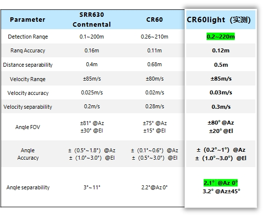

博世低成本soc要28-29年才能出来


24年底 森斯泰克2944 115-120售价

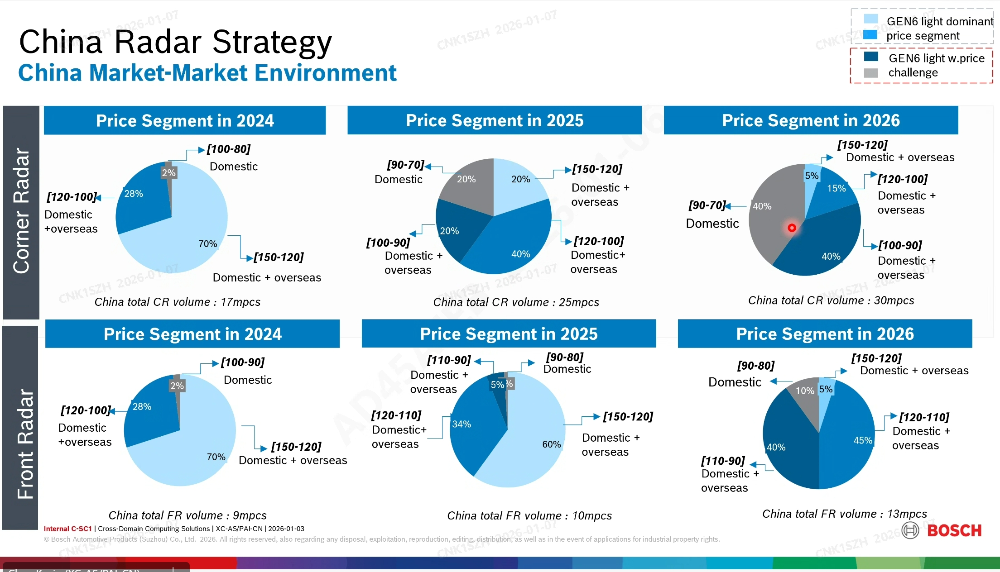

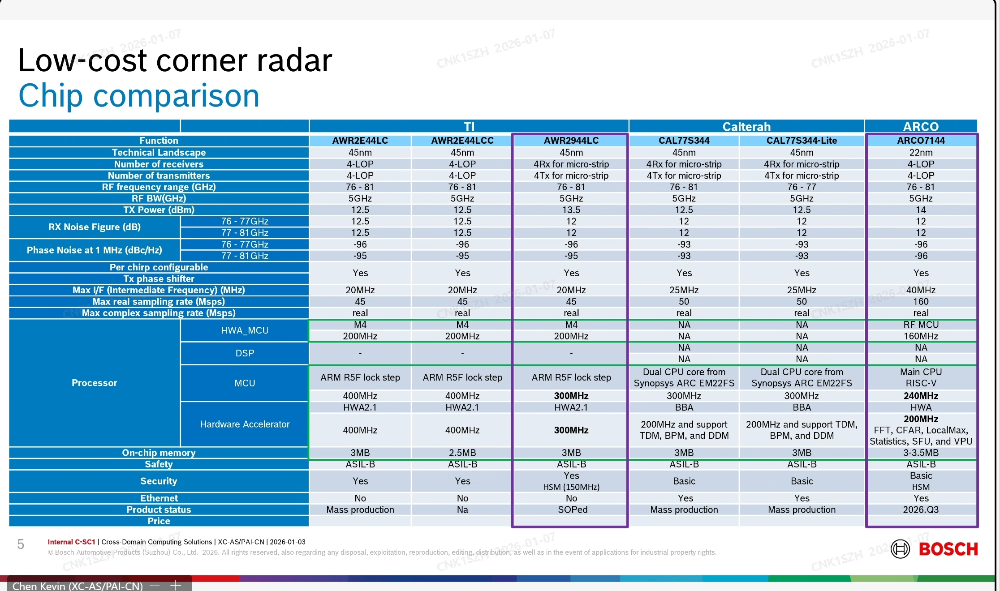


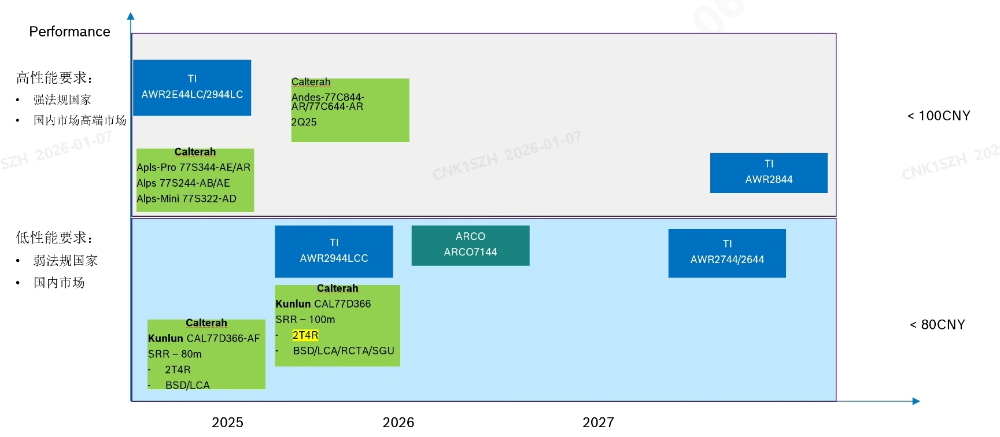


CR60 Light卖给博世，BOM（Bill of Material）亏4块，不算人力成本

博世平台CR60长城报价：140-150

KC说六代其他oem报价200元，五代降价后150左右

light估计便宜30-40，在120+

light因不对称天线，接插件必须朝外。

底软费用加上WF研发费、ME费用，WF开发CR60 Light亏八九千万


比亚迪要求售价105

卖给博世，单件亏2.5，ME单件制造报价拿走16元（KC说低于10元）


## 内存：

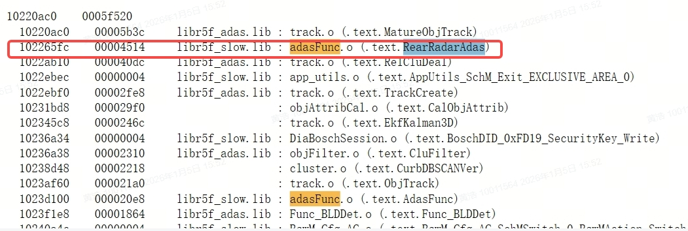

内存：adasFunc.o: 4514（16进制），17.684kb


## 项目：

- SAIC：开发模式xc做功能，WF出0.2个人头，但ASW代码对ITK开放，不对xc开放
- BYD：开发对称式天线
- 

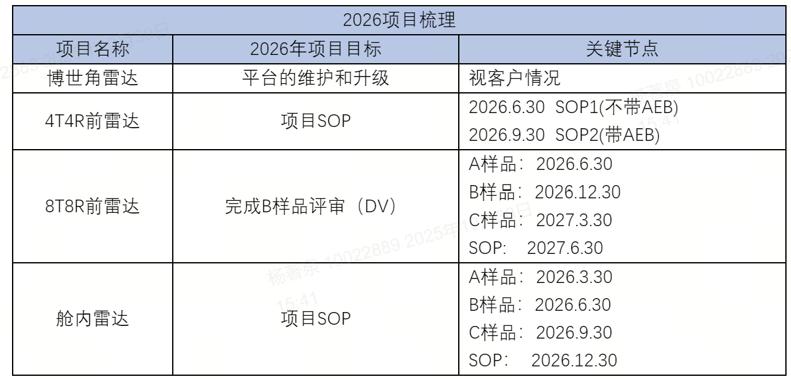  

 

2026.2.9

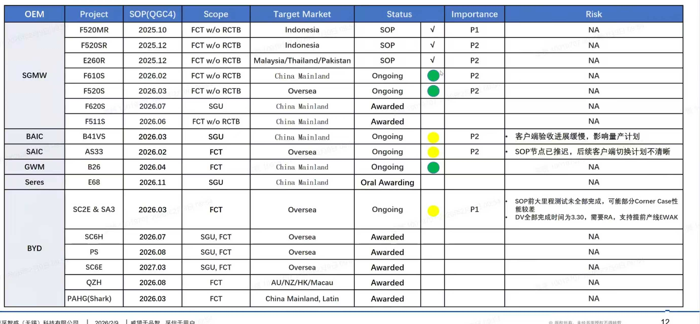

2026.6.1

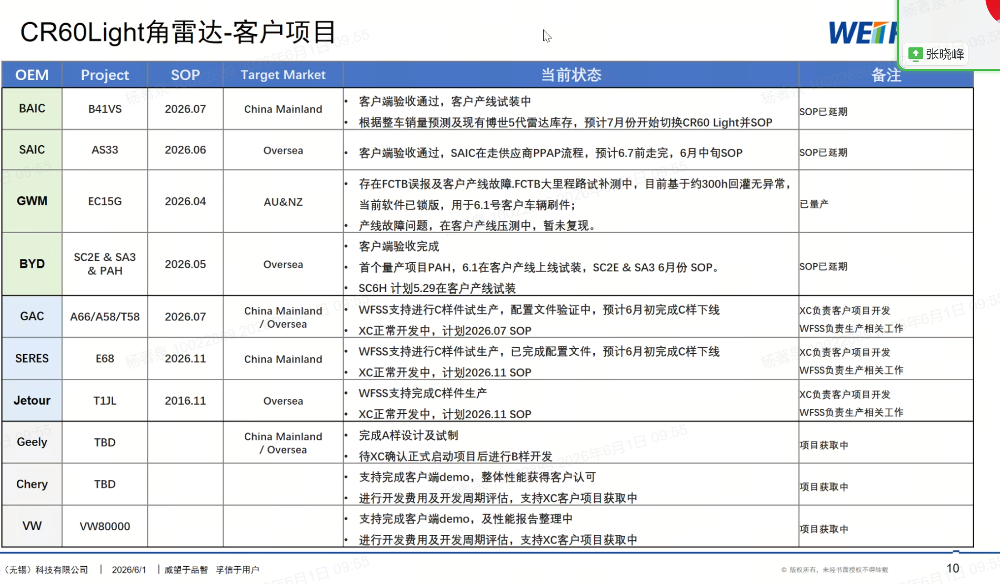

赋型推荐安装角度：30-50度

## 耗时：

asw耗时包括了LGU+SGU+FCT

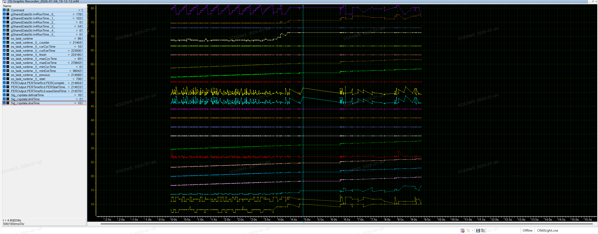

后处理：complete-start = 31ms

M4那边 17.8 10.3 5.4 

R5F rsp 16 2 10

wave send是M4的起始时间

PERStartTime - wave send = M4总时间 + RSP总时间

```c
// M4 0-3是各个阶段的耗时

gSharedDataStr.m4RunTime[0]

gSharedDataStr.m4RunTime[1]

gSharedDataStr.m4RunTime[2]

gSharedDataStr.m4RunTime[3]

gSharedDataStr.m4RunTime[4]

gSharedDataStr.m4RunTime[5]


// RSP runtime on R5F

Sig_cspdata.doaTime

Sig_cspdata.dmlTime

Sig_cspdata.defmatTime;


// Per 

PEROutput.PERTimeRcd.waveSendTime

PEROutput.PERTimeRcd.PERStartTime

PEROutput.PERTimeRcd.PERCompletionTime


//

os_task_runtime
```


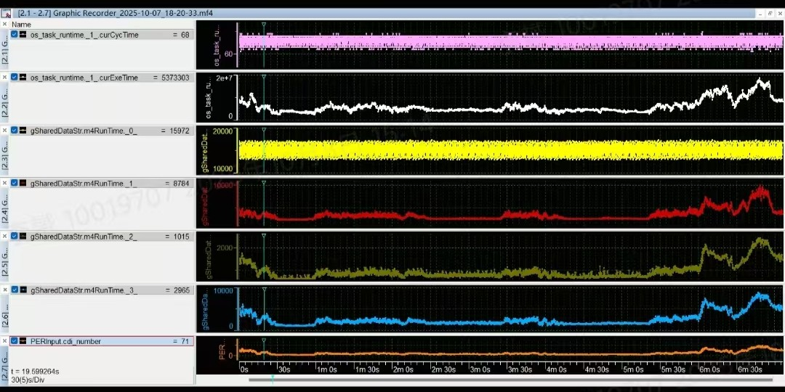

最下面的是点云数量，os是per的运行时间，其他的是rsp的处理时间

- rsp处理时间和点云数量是几乎一致的
  - M4_Task1: 1D FFT
  - M4_Task2: 2D FFT
  - M4_Task3: CFAR
  - M4_Task4: DOA
  - M4的任务是串行设计，所以直接按照顺序 1-2-3-4排序
- OS(per)的时间看起来和点云数量趋势相似，但不能说250个点的运行时间就比350个点少，还要区分具体场景
  - 理论上OS时间小于50ms，即可保证不超时
  - HWA一结束DOA，R5F即可开始OS

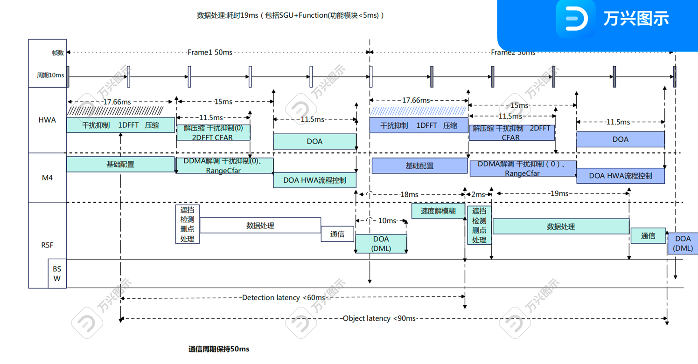

- 还有个R4核只负责发波
- 66ms和50ms版本均如此调度


圈复杂度、嵌套层数


前雷达demo：2e44lc

- 暂时88ms，受限于CAN传输速度
- 波导天线
- 512 detections
- 50 objects
- range 0.1m - 300m
- azi fov +-60deg
- ele fov +-20deg


角雷达：2e44lc (没有dsp核)

- 波导天线 waveguide antenna
- 50ms (66ms -->50ms)
- 350 detections
- 32OD
- 纯距离bin 0.6m，但波形在速度维上耦合了速度和距离，使距离bin降到0.24m
- 算法300K + 128K
  - 300K包括fft后的解角、tracker、function
  - 128K只能用来存数据

点云俯仰信息：

- 识别隧道模式
- 标定
- 个别虚警删除


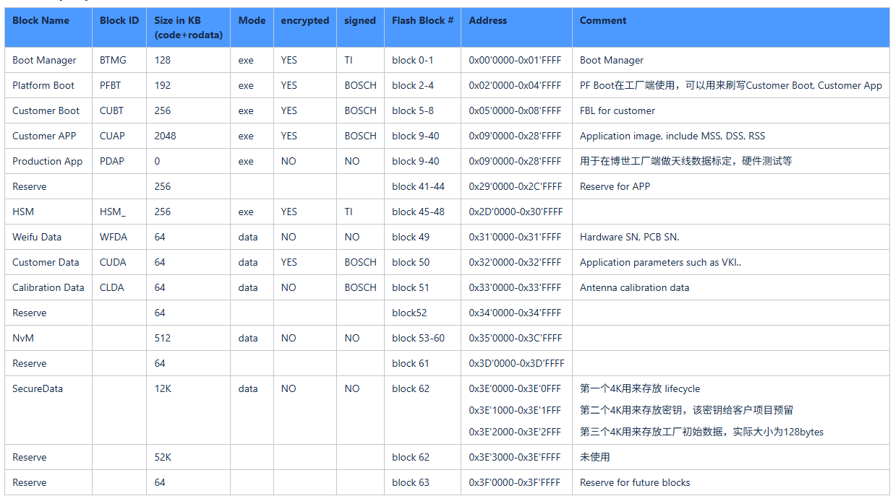

